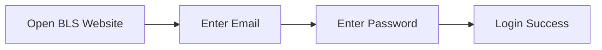
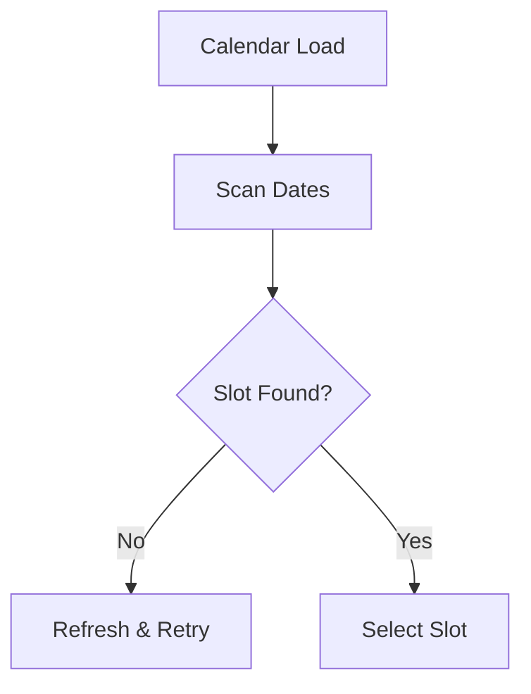
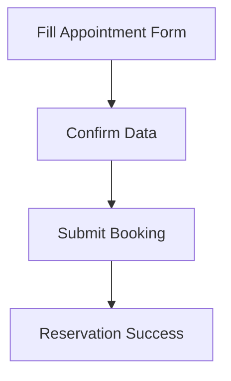
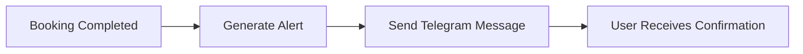
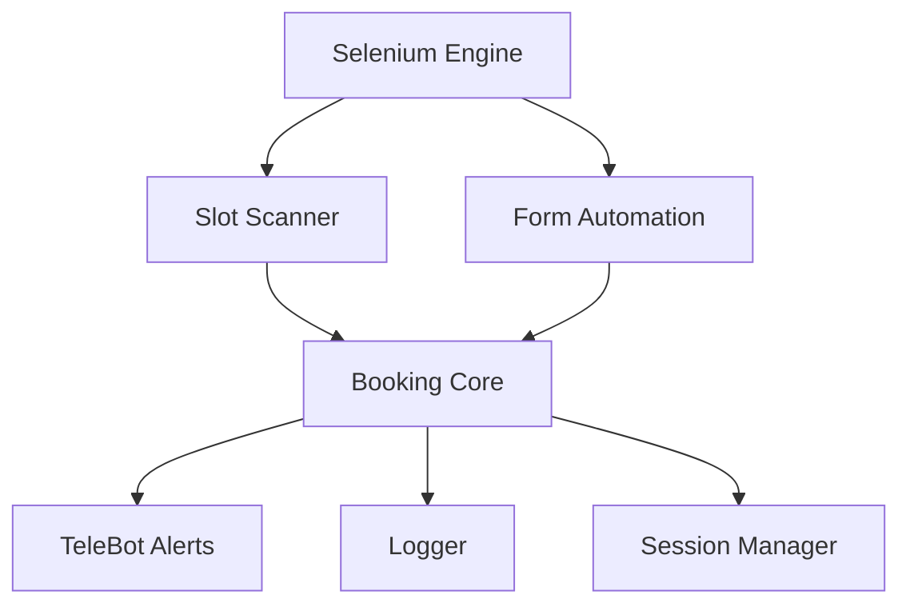
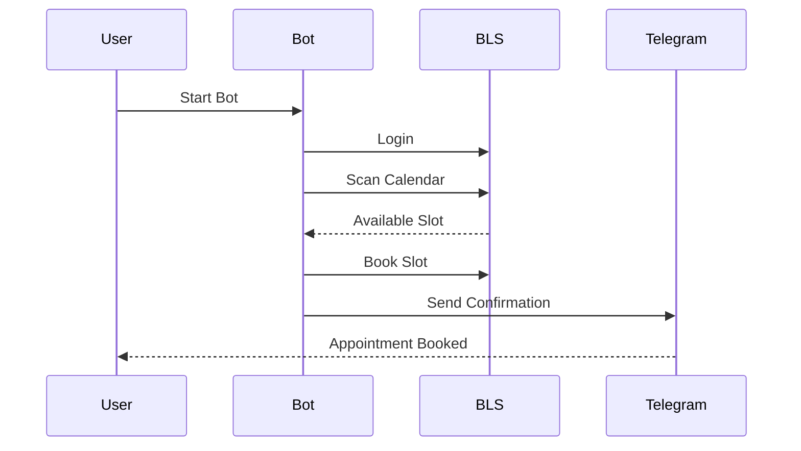

#  BLS Morocco Appointment Bot  
### 🔹 Smart Automated Visa Booking System for BLS Morocco  
> Fully automated visa appointment booking system built using **Python**, **Selenium**, and **TeleBot** — engineered for accuracy, speed, and stealth automation.
# 🎯 BLS Morocco Appointment Bot

<div align="center">


<br/>


<br/>


</div>

---

## 🧠 Overview

**BLS Morocco Appointment Bot** is an intelligent automation system for monitoring and booking visa appointments automatically.

Built with **Python**, **Selenium**, and **TeleBot** to provide:

- Real-time slot detection
- Instant booking execution
- Telegram notifications
- Human-like browser automation

---

# 📸 Booking Process Visualization 

## 1️⃣ Login Stage



---

## 2️⃣ Slot Scanning



---

## 3️⃣ Auto Booking



---

## 4️⃣ Telegram Notification



---

## ⚙️ Key Features

✅ Real-Time Slot Monitoring  
✅ Auto Booking Logic  
✅ Smart Retry System  
✅ Telegram Notifications  
✅ Human Behavior Simulation  
✅ Anti-Detection Delays  
✅ Session Persistence  
✅ Fast Execution Engine  

---

## 🏗 System Architecture



---

## 🔍 Full Workflow



---

## 💻 Quick Setup

```bash
git clone https://github.com/YanaYaanto/BLS_Morocco_Appointment_Bot.git

cd BLS_Morocco_Appointment_Bot

pip install -r requirements.txt

python Appointment_Bot.py
```

---

## 🔧 Configuration

Edit:

```python
BOT_TOKEN = "YOUR_TELEGRAM_BOT_TOKEN"
EMAIL = "YOUR_BLS_EMAIL"
PASSWORD = "YOUR_BLS_PASSWORD"
```

---

## 🛠 Tech Stack

| Technology | Purpose |
|---|---|
| Python | Core Programming |
| Selenium | Browser Automation |
| TeleBot | Notifications |
| Requests | HTTP Handling |
| Logging | Debugging |
| Undetected ChromeDriver | Anti Detection |

---

## 📊 Live Status

```diff
+ Bot Running
+ Monitoring Slots
+ Waiting for Availability
+ Ready to Book
```

---

## 📘 Disclaimer

This project is for educational and research purposes only.

Use responsibly and respect official BLS platform rules.

---

<div align="center">

## ⭐ Star the Repository if you like it


</div>
--


---

## 🧠 Overview  
**BLS Morocco Appointment Bot** is an intelligent automation tool designed to book **visa appointments** on the official **BLS Algeria** website automatically.  

Using **Selenium WebDriver** and **Telegram API (TeleBot)**, the system simulates human behavior to:  
- Detect available appointment slots in real time  
- Reserve them instantly  
- Send confirmation and alerts via Telegram  

This project was created for **educational and research purposes only**, to demonstrate how browser automation works responsibly with dynamic and secure systems.

---

## ⚙️ Key Features  
- 🕒 **Real-Time Slot Monitoring** – Continuously checks BLS Morocco for open appointments.  
- 🤖 **Auto Booking Logic** – Handles login, calendar navigation, and form submission automatically.  
- 💬 **Telegram Notifications** – Instantly informs you when a slot is found or booked.  
- 🔐 **Human-Like Behavior** – Randomized delays and interaction patterns to avoid detection.  
- ⚡ **Fast & Reliable** – Built for stability even under high server load.  

---

## 🏗️ System Architecture

+-------------------------------------------------------+ |               BLS Morocco Appointment Bot             | +-------------------------------------------------------+ |  Selenium Engine |  TeleBot Integration |  Core Logic | +-------------------------------------------------------+ |  Slot Scanner    |  Form Filler         |  Scheduler  | +-------------------------------------------------------+ |  Telegram Alerts |  Session Manager     |  Logger     | +-------------------------------------------------------+

Each module works independently — ensuring the system remains modular, stable, and easy to maintain.

---

## 🔍 Workflow  
1. **Login Phase** – The bot logs into your BLS Morocco account.  
2. **Scan Phase** – It monitors for available appointment slots.  
3. **Detection Phase** – When a slot is found, the bot instantly reserves it.  
4. **Notification Phase** – A Telegram message confirms the booked slot.  

---

## 💻 Quick Setup  
1. Clone the repository:  
   ```bash
   git clone https://github.com/YanaYaanto/BLS_Morocco_Appointment_Bot.git
   cd BLS_Morocco_Appointment_Bot

2. Edit config.py or Appointment_Bot.py to set:

Your Telegram BOT_TOKEN

Your BLS credentials

Path to your WebDriver (.exe)


3. Run the bot:

python Appointment_Bot.py


---

🧠 Tech Stack

Language: Python 3.10+

Automation: Selenium WebDriver

Notifications: TeleBot (Telegram Bot API)

Scheduler: Custom event-driven loop

Logging: Built-in Python logger

Platform: BLS Algeria


---

📘 Disclaimer

This project is for educational and non-profit use only.
I am not responsible for misuse, abuse, or violations of BLS systems.

> ⚠️ Use responsibly — respect visa systems and official rules.


---

🧩 Learn More

Detailed tutorial (English):
🔗 Booking a Visa Appointment using Selenium & TeleBot


---

💰 Purchase the Private Version

Want the advanced private build with:
✅ Auto Calendar Navigation
✅ Anti-Captcha & Anti-Block
✅ 24/7 Background Monitoring
✅ Multi-Account Support

👉 Buy Now on WhatsApp


---

🧑‍💻 Developer

Crafted with ❤️ by a passionate automation developer.
For private projects, collaborations, or inquiries:
📞 wa.me/+201286016083


---

⭐ If this project inspires you, don’t forget to star the repo!
